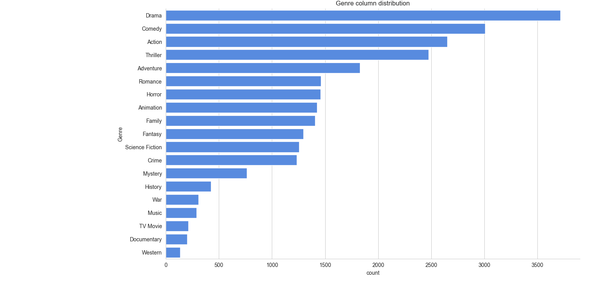
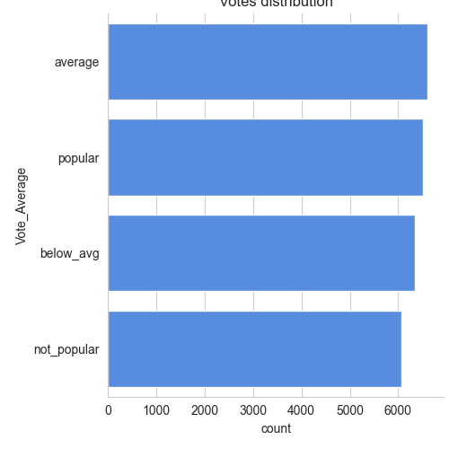
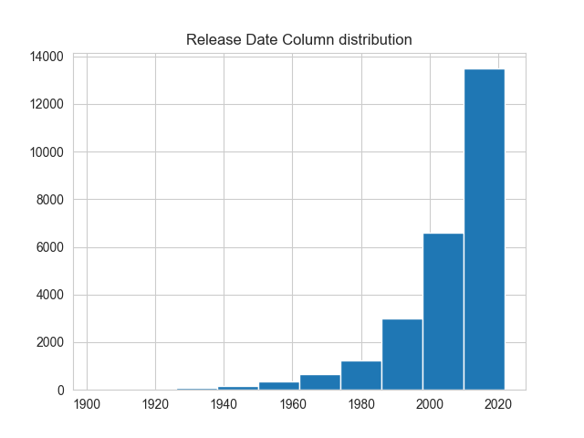

# 📊 Netflix Movies Analysis

A data-driven exploration of Netflix movie trends using Python. This project analyzes genres, popularity, vote averages, and release patterns to uncover insights from a large movie dataset.

---

## 📁 Dataset

- **File used:** `mymoviedb.csv`
- **Source:** Curated Netflix movie dataset with columns like `Title`, `Genre`, `Popularity`, `Vote_Average`, `Release_Date`, etc.

---

## 🔧 Technologies Used

- **Python** 🐍
- **Libraries:** NumPy, Pandas, Matplotlib, Seaborn
- **IDE:** Visual Studio Code
- **Version Control:** Git & GitHub

---

## 🧪 Data Preprocessing

- Converted `Release_Date` to year format using `pd.to_datetime()`
- Dropped irrelevant columns: `Overview`, `Original_Language`, `Poster_Url`
- Removed duplicates and null values
- Split multi-genre entries into individual rows using `.explode()`
- Categorized `Vote_Average` into 4 bins:  
  `not_popular`, `below_avg`, `average`, `popular`

---

## 📈 Visualizations

1. **Genre Distribution**  
   Most frequent genres on Netflix visualized using `sns.catplot()`

2. **Vote Average Distribution**  
   Categorized vote averages plotted to show viewer sentiment

3. **Popularity Extremes**  
   - Highest popularity movie and its genre
   - Lowest popularity movie and its genre

4. **Release Year Trends**  
   Histogram showing which years had the most movie releases

---

## 🔍 Key Insights

- 🎬 **Most Frequent Genre:** Identified using value counts and visualized
- ⭐ **Vote Analysis:** Categorized viewer ratings into meaningful buckets
- 🔥 **Top Movie by Popularity:** Extracted using `df['Popularity'].max()`
- 🧊 **Least Popular Movie:** Extracted using `df['Popularity'].min()`
- 📅 **Peak Release Year:** Visualized with histogram

---

## 📂 Folder Structure
```
Netflix-Movies-Analysis/
├── mymoviedb.csv 
├── NetflixDataAnalysis.py
├── README.md
├── outputs/
           │ ├── genre_distribution.png
           │ ├── vote_distribution.png 
           │ └── release_year_histogram.png
 ```
## 📊 Sample Visualizations

### 🎬 Genre Distribution


### ⭐ Vote Average Distribution


### 📅 Release Year Histogram



           

